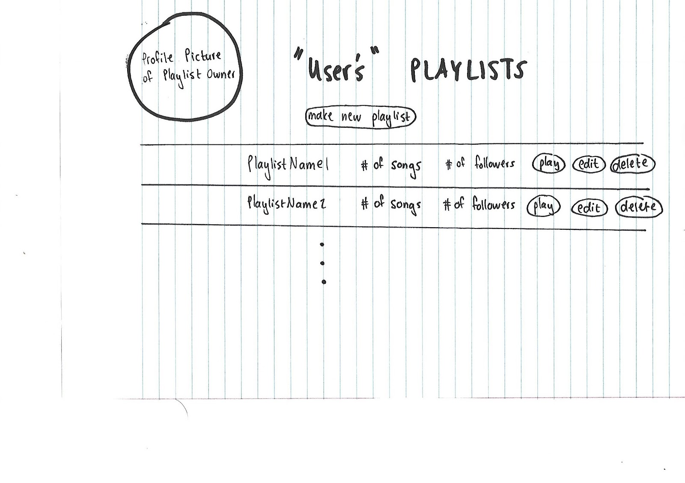
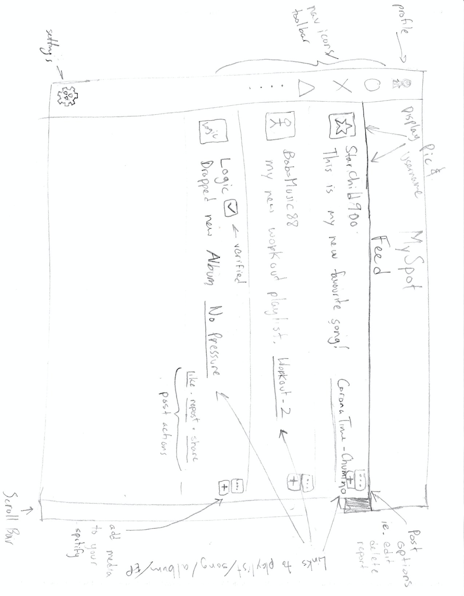

# MySpot

### Description:

MySpot is a social media platform for music lovers who want to connect with other Spotify users. MySpot allows users to share music posts (Spotify playlists, albums, songs), see what their fellow MySpotters are listening to, build playlists, and discover new music. 

### Project Task Requirements:

**3-5 minimal requirements (will definitely complete):**
1. Public profile page
2. Follow people
3. Log in to your profile to see the playlists of the people you follow
   * See who’s currently online
4. Edit/View your own playlist
5. Search for songs/albums
    
**3-7 "standard" requirements (will most likely complete)** 
1. Show followers what you’re listening 
   * See what your followees are listening 
2. Dashboard/ Feed
   * Different types of posts (ie. playlists, songs, artists..)
   * Share playlists/song/album with others (default post is playlist) onto the Feed
3. Follower/ Followee Actions
4. Playlists on web app directly edit your Spotify playlists
5. Get recommendations based on you like
6. Chat/  Message ability with other User’s

**2-3 stretch requirements (plan to complete 1!)**
1. Tinderify (swipe left or right on randomly generated playlists to add them to your playlists)
2. Priority feed of followee’s activities
3. Explore page (like IG)
4. Make playlists on the application from scratch rather than on Spotify

### 2 Minimal Requirement Breakdowns:

**Add People I’m Following:**
1. Click “follow” from another user’s profile page to add them to your “People I’m Following” list
2. Add new followee to database
3. Delete followee (unfollow) - either on their profile or from “People I’m Following” list
4. Populate following list from database
5. Display following list on profile (your and others’)
    
**Log In/ Sign Up:**
1. If a new MySpot user has a Spotify account then sign up and populate user info via API/authenticate user credentials.
   * If not, indicate to the new MySpot user that they need a Spotify account to proceed. Provide a link to Spotify’s create new account page. 
3. If an existing MySpot user Login/ Get access to the user’s spotify account via API/authenticate user credentials.
4. Upon successful sign up,redirect to the user’s profile friends list with friend suggestions (potentially based of FaceBook)
5. Upon successful login, redirect user to main Feed

### Prototypes

**Here's what I'm listening to** (Profile Component)

**Playlist** (Profile Component)

**Activity Feed**

**Profile Page**

